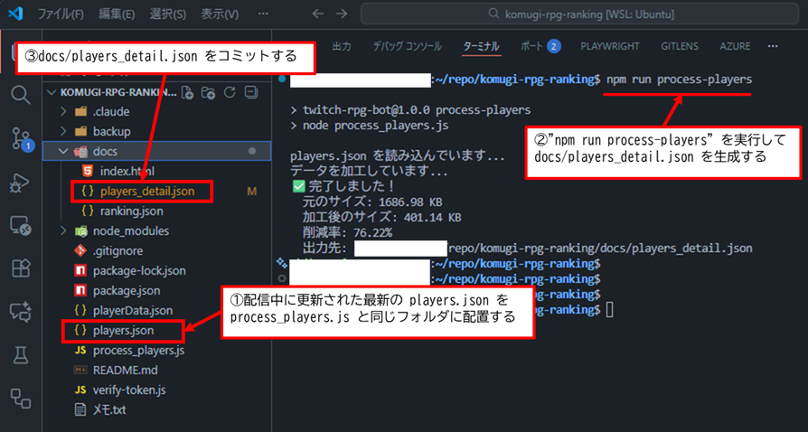

# komugi-rpg-ranking

## Webサイト仕様 (docs/index.html)

### 概要

komugi RPGの各種ランキングとプレイヤー詳細情報を表示するWebサイト。

### 主な機能

#### 1. ランキング表示

以下の4種類のランキングをタブで切り替えて表示します：

- **⚡ プレステージ**: プレステージ回数のランキング
- **⚔️ 最高攻撃力**: 攻撃力の最大値ランキング
- **💥 最大ダメージ**: 与えたダメージの最大値ランキング
- **✨ スキル数**: 所持スキル数のランキング

#### 2. プレイヤー詳細画面

ランキング画面でプレイヤー名をクリックすると、そのプレイヤーの詳細情報を表示します。

**表示内容:**

- プレイヤーの基本ステータス（レベル、攻撃力、経験値、プレステージ、ドラゴンHP）
- 所持スキル一覧（レアリティ別）
- 所持装備一覧（レアリティ別）

**フィルター機能:**

- スキル/装備をレアリティごとに集計表示
- 各種パラメータ（攻撃、クリティカル率、ドロップ率など）でフィルタリング可能

#### 3. デザイン特徴

- サイバーパンク風のRPGテーマデザイン
- レアリティごとの色分け表示（EX, GR, MR, LR, UR, SR, R, N）
- アニメーション効果（星の背景、ランクグロー効果など）
- レスポンシブ対応

### 使用データファイル

- `docs/ranking.json`: ランキングデータ
- `docs/players_detail.json`: プレイヤー詳細データ（装備・スキル情報）

---

## docs/players_detail.json の更新方法

### 概要

`docs/players_detail.json` は、プレイヤーの詳細情報（装備・スキル）を格納したファイルです。
このファイルは、ルートディレクトリの `players.json` を加工して生成されます。

### 更新手順

#### 1. データソースの準備

ルートディレクトリに最新の `players.json` を配置します。

#### 2. process_players.js の実行

以下のコマンドを実行して、`players.json` から `docs/players_detail.json` を生成します：

```bash
npm run process-players
```

または直接実行：

```bash
node process_players.js
```

#### 3. 処理内容

`process_players.js` は以下の処理を行います：

- 重複する装備・スキルをグループ化してカウント
- 各プレイヤーのステータス情報を整理
- ファイルサイズを削減（同名アイテムの統合により約70-80%削減）
- 最終更新日時を付与

### 実行イメージ

以下の画像は、`process_players.js` の実行プロセスを示しています：



**実行の流れ:**

1. ルートディレクトリの `players.json` を対象ファイルとして配置
2. ターミナルで `npm run process-players` を実行
3. `docs/players_detail.json` が生成され、コミット対象となる

### 出力ファイル構造

```json
{
  "lastUpdate": "2025-01-17T12:00:00.000Z",
  "players": {
    "プレイヤー名": {
      "level": 100,
      "exp": 12345,
      "attack": 500,
      "prestigeCount": 10,
      "dragonHP": 1000000,
      "equipment": [
        {
          "name": "装備名",
          "rarity": "LR",
          "attack": 50,
          "count": 3
        }
      ],
      "skills": [
        {
          "name": "スキル名",
          "rarity": "UR",
          "effect": "効果説明",
          "count": 2
        }
      ]
    }
  }
}
```

### 注意事項

- `players.json` が更新された際は、必ず `process_players.js` を実行してください
- 生成された `docs/players_detail.json` をコミットしてください
- Webサイトは `docs/players_detail.json` を読み込んでプレイヤー詳細を表示します
